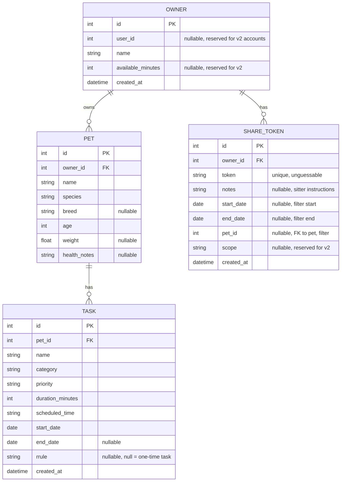

# Akita — Database Schema (v1)

## Entity Relationship Diagram

---

## Tables

### `owner`

Anonymous, persistent owner record. One per browser-stored ID.

| Column             | Type      | Constraints              | Notes                                              |
|---------------------|-----------|----------------------------|----------------------------------------------------|
| `id`                | integer   | PK, auto-increment         |                                                      |
| `user_id`           | integer   | nullable, unused in v1     | Reserved for v2 accounts.                           |
| `name`              | string    | required                   | Display name, e.g. "Alex"                           |
| `available_minutes` | integer   | nullable, unused in v1     | Reserved for v2 time-budget scheduling.             |
| `created_at`        | datetime  | required, default now      |                                                      |

### `pet`

Belongs to one owner.

| Column         | Type    | Constraints              | Notes                                              |
|-----------------|---------|---------------------------|-----------------------------------------------------|
| `id`            | integer | PK, auto-increment        |                                                       |
| `owner_id`      | integer | FK → `owner.id`, required |                                                       |
| `name`          | string  | required                  |                                                       |
| `species`       | string  | required                  | `"Dog"`, `"Cat"`, etc.                                |
| `breed`         | string  | nullable                  |                                                       |
| `age`           | integer | required                  |                                                       |
| `weight`        | float   | nullable                  |                                                       |
| `health_notes`  | string  | nullable                  | Appended to RAG context sent to Groq for this pet's tasks. |

### `task`

Belongs to one pet. Represents a scheduled activity, not a completable
to-do — there is no completion state in v1.

| Column              | Type     | Constraints              | Notes                                                         |
|----------------------|----------|---------------------------|----------------------------------------------------------------|
| `id`                 | integer  | PK, auto-increment        |                                                                  |
| `pet_id`             | integer  | FK → `pet.id`, required   |                                                                  |
| `name`               | string   | required                  |                                                                  |
| `category`           | string   | required                  | `meds`, `vet`, `feeding`, `walk`, `grooming`, `play`, `training`, `general` |
| `priority`           | string   | required                  | `non-negotiable`, `high`, `medium`, `low`                        |
| `duration_minutes`   | integer  | required                  |                                                                  |
| `scheduled_time`     | string   | required                  | 24-hour `"HH:MM"`                                                |
| `start_date`         | date     | required                  |                                                                  |
| `end_date`           | date     | nullable                  | Null = recurs indefinitely (subject to `rrule`).                 |
| `rrule`              | string   | nullable                  | Null = one-time task on `start_date`. Otherwise an RRULE string. |
| `created_at`         | datetime | required, default now     |                                                                  |

### `share_token`

Belongs to one owner. Grants read-only access to that owner's schedule
via an unguessable link, optionally filtered to a date range and/or a
specific pet — designed for handing a scoped view to a pet sitter.

| Column        | Type     | Constraints                 | Notes                                                  |
|----------------|----------|--------------------------------|--------------------------------------------------------|
| `id`           | integer  | PK, auto-increment             |                                                          |
| `owner_id`     | integer  | FK → `owner.id`, required      |                                                          |
| `token`        | string   | required, unique               | Randomly generated, used in the share URL.              |
| `notes`        | string   | nullable                       | Freeform sitter instructions, shown at top of shared view. |
| `start_date`   | date     | nullable                       | If set, shared view only shows tasks from this date.    |
| `end_date`     | date     | nullable                       | If set, shared view only shows tasks through this date. |
| `pet_id`       | integer  | nullable, FK → `pet.id`        | If set, shared view only shows this pet's tasks.        |
| `scope`        | string   | nullable, unused in v1         | Reserved for v2 — e.g. `"read"` vs `"edit"`.            |
| `created_at`   | datetime | required, default now          |                                                          |

---

## v2 Addition: `task_completion`

Not in v1. When completion tracking is added, this table records which
occurrence of a recurring task was completed on which date, without
touching the `task` table itself.

| Column           | Type     | Constraints              | Notes                        |
|-------------------|----------|---------------------------|-------------------------------|
| `id`              | integer  | PK, auto-increment        |                                 |
| `task_id`         | integer  | FK → `task.id`, required  |                                 |
| `completed_date`  | date     | required                  | Which occurrence was completed. |
| `created_at`      | datetime | required, default now     |                                 |